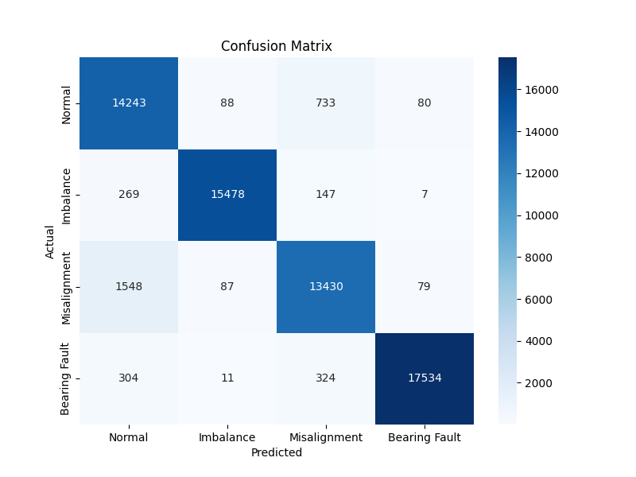
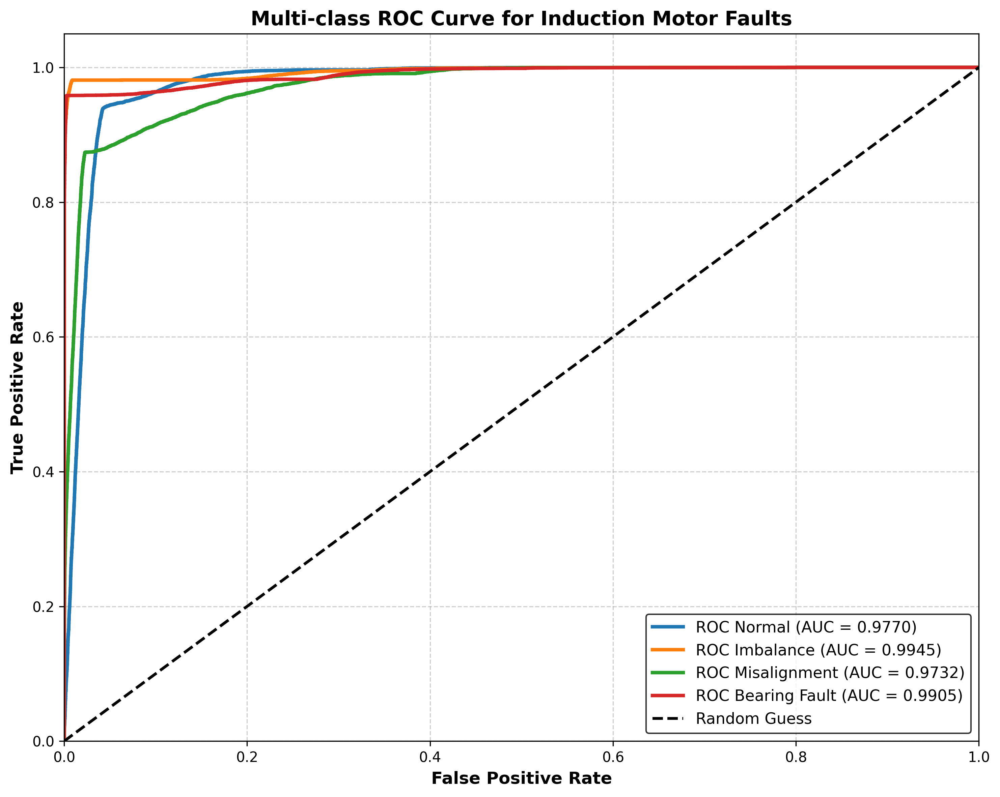

# Induction Motor Early Fault Diagnosis

Machine learning pipeline for early fault diagnosis of induction motors using vibration signals from the **MAFAULDA** (Machinery Fault Database). The system classifies four operating states — **Normal, Imbalance, Misalignment, Bearing Fault** — using statistical time-domain features and an SVM (RBF, One-vs-One) classifier.

## 1. Introduction

Unplanned downtime caused by rotating-machinery failure is costly in industrial settings. This project builds an end-to-end pipeline that:

1. Selects a stratified, memory-efficient subset of raw MAFAULDA CSV recordings.
2. Windows the multi-sensor signals and extracts 11 statistical features per channel (66 features/window).
3. Splits, scales, and balances the dataset (Random Oversampling).
4. Trains an SVM (RBF kernel, OvO) classifier and evaluates it with accuracy, F1-score, confusion matrix, and multi-class ROC/AUC.

## 2. Data Access & Storage Setup

All datasets and trained models are hosted externally (raw size is too large for GitHub).

| Resource | Description | Link |
|---|---|---|
| Raw Data | Original MAFAULDA dataset | [MAFAULDA Site](https://www02.smt.ufrj.br/~offshore/mfs/page_01.html#SEC2) |
| Windows | Pre-windowed `.npy` segments | [Google Drive](https://drive.google.com/drive/folders/1UCrFhIcBjG6rHqRBadA90EeZO-Z70iS2?hl=vi) |
| Ready Data | Split/scaled/oversampled train-test sets | [Google Drive](https://drive.google.com/drive/folders/1mhy-3LaTjHwuUgNYg0krnL1UQUKlpy86?hl=vi) |
| Trained Models | Fitted scaler + SVM model | [Google Drive](https://drive.google.com/drive/folders/1Pa9SiCbKa3wbol7ynpMWHbhhr_DTkRte?hl=vi) |

### Option A — Google Colab (recommended)
```python
from google.colab import drive
drive.mount('/content/drive')
```
Place the downloaded folders under `/content/drive/MyDrive/mafaulda` (raw data) and `/content/drive/MyDrive/data` (pipeline outputs), matching the defaults in `setup_env_constants.py`.

### Option B — Local machine
Download the folders above and update the paths in `setup_env_constants.py`:
```python
BASE_DATA_PATH = 'path/to/mafaulda'      # raw MAFAULDA data
OUTPUT_BASE_PATH = 'path/to/output'      # windows, features, models, results
```

## 3. Installation

Requires **Python 3.9+**.

```bash
git clone https://github.com/NguyenDanhDuy/Induction-Motor-Early-Fault-Diagnosis.git
cd Induction-Motor-Early-Fault-Diagnosis

python -m venv venv
source venv/bin/activate        # Windows: venv\Scripts\activate

pip install -r requirement.txt
```

**Dependencies:** numpy, pandas, scipy, scikit-learn, imbalanced-learn, joblib, matplotlib, seaborn, tqdm.
**Install each requiment manual if using colab.

## 4. Running the Pipeline (`src/`)

Run the scripts in order — each stage reads the output of the previous one from the directories defined in `DIRS`.

| Step | Script | Purpose |
|---|---|---|
| 0 | `setup_env_constants.py` | Configure paths, signal window size (132), stride, target sensor columns |
| 1 | `preprocessing.py` | Select stratified CSV subset (`data_selection.py`) and generate sliding windows |
| 2 | `feature_extraction.py` | Extract 11 statistical features × 6 sensors → 66-D feature vectors |
| 3 | `data_preparation.py` | Stratified train/test split, standard scaling, Random Oversampling |
| 4 | `model_training.py` | Train SVM (RBF, OvO), evaluate, save model + plots |

```bash
python setup_env_constants.py
python preprocessing.py
python feature_extraction.py
python data_preparation.py
python model_training.py
```

Trained artifacts (`scaler.pkl`, `svm_model.pkl`) and evaluation plots are saved to `DIRS['models']` and `DIRS['results']`.

## 5. Results

**Model:** SVM (RBF kernel, One-vs-One) | **Test Accuracy:** 94.29% | **Macro F1-score:** 94.11%

| Class | Precision | Recall | F1-Score |
|---|---|---|---|
| Normal | 0.87 | 0.94 | 0.90 |
| Imbalance | 0.99 | 0.97 | 0.98 |
| Misalignment | 0.92 | 0.89 | 0.90 |
| Bearing Fault | 0.99 | 0.96 | 0.98 |

**Confusion Matrix**




**Multi-class ROC Curve**





Bearing Fault and Imbalance classes achieve the strongest separability (AUC ≥ 0.99), while Normal and Misalignment show some overlap, consistent with their closer vibration signatures.

## 6. Project Structure

```
Induction-Motor-Early-Fault-Diagnosis/
├── src/
│   ├── setup_env_constants.py
│   ├── data_selection.py
│   ├── preprocessing.py
│   ├── feature_extraction.py
│   ├── data_preparation.py
│   └── model_training.py
├── results/
│   ├── confusion_matrix.png
│   └── roc_curve_multiclass.png
├── model_performance_metrics.txt
├── requirement.txt
└── README.md
```

